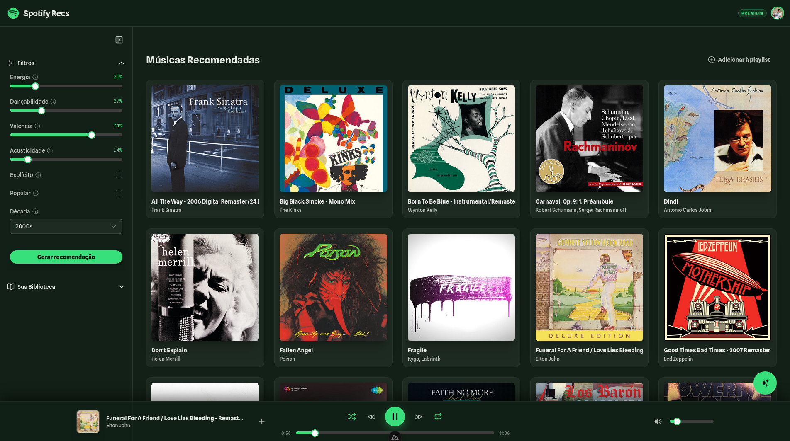

# Spotify Recs - Frontend



Este repositório contém o código-fonte do frontend para o Sistema Agêntico do Spotify. A aplicação é construída com **Nuxt 4**, utilizando **Nuxt UI** para a interface e **TypeScript**.

O objetivo deste frontend é fornecer uma interface moderna e responsiva para interagir com o sistema agêntico, permitindo aos usuários controlar a reprodução do Spotify, visualizar playlists e conversar com o assistente de IA.

## 🚀 Tecnologias Utilizadas

- **[Nuxt 4](https://nuxt.com/)**: Framework Vue.js para aplicações web modernas.
- **[Nuxt UI](https://ui.nuxt.com/)**: Biblioteca de componentes baseada em Tailwind CSS.
- **[Tailwind CSS](https://tailwindcss.com/)**: Framework de utilitários CSS.
- **TypeScript**: Superset tipado de JavaScript.
- **Axios**: Cliente HTTP para comunicação com a API.
- **Icons**: Integração com Iconify (Lucide, Simple Icons).

## ✨ Principais Funcionalidades

- **🎧 Player Integrado (Spotify SDK)**: Controle total de reprodução (play, pause, pular, volume) diretamente na interface, com feedback em tempo real do estado do player.
- **💬 Chat Agêntico**: Interface conversacional para interagir com o assistente de IA, permitindo solicitar ações complexas em linguagem natural.
- **📋 Gerenciamento de Playlists**: Criação, edição e visualização de playlists, com capacidade de adicionar ou remover faixas de forma intuitiva.
- **🎵 Recomendação de Músicas**: Sistema inteligente de recomendação que utiliza IA para sugerir faixas baseadas no contexto e nas preferências do usuário.
- **🔍 Navegação na Biblioteca**: Visualização de álbuns, artistas e faixas salvas, integrada com a busca do Spotify.

## 📦 Instalação e Execução

### Via Docker (Recomendado)

A execução principal deste serviço é orquestrada via Docker, garantindo que todo o ecossistema (backend, frontend, banco de dados) funcione em harmonia.

Consulte o repositório de infraestrutura para instruções detalhadas:

👉 **[https://github.com/Rhogger/spotify-agentic-system-infra](https://github.com/Rhogger/spotify-agentic-system-infra)**

### Desenvolvimento Local

Para rodar o projeto localmente para desenvolvimento ou testes:

#### Pré-requisitos

- Node.js (versão LTS recomendada)
- pnpm (gerenciador de pacotes)

#### Passos

1. Instale as dependências:
   ```bash
   pnpm install
   ```

2. Configure as variáveis de ambiente (se necessário):
   O frontend espera comunicar-se com a API. Por padrão, ele aponta para `http://localhost:8000`. Você pode alterar isso via variável de ambiente `NUXT_PUBLIC_API_BASE_URL`.

3. Inicie o servidor de desenvolvimento:
   ```bash
   pnpm dev
   ```
   A aplicação estará disponível em `http://localhost:3000`.

## 🛠️ Scripts Disponíveis

- `pnpm dev`: Inicia o servidor de desenvolvimento com hot-reload.
- `pnpm build`: Compila a aplicação para produção.
- `pnpm preview`: Visualiza a versão de produção localmente.
- `pnpm lint`: Executa o linter (ESLint) para verificar problemas no código.
- `pnpm typecheck`: Executa a verificação de tipos do TypeScript.

## 📂 Estrutura do Projeto

O projeto segue a estrutura padrão do Nuxt 4 com `srcDir` configurado para `app/`:

- `app/assets`: Arquivos estáticos (CSS, imagens).
- `app/binds`: Configurações de injeção de dependência.
- `app/components`: Componentes Vue reutilizáveis.
- `app/composables`: Lógica reutilizável (Composition API).
- `app/layouts`: Layouts da aplicação.
- `app/models`: Interfaces e tipos TypeScript.
- `app/pages`: Páginas da aplicação (roteamento automático).
- `app/services`: Serviços para comunicação com APIs externas.
- `nuxt.config.ts`: Arquivo de configuração principal do Nuxt.
